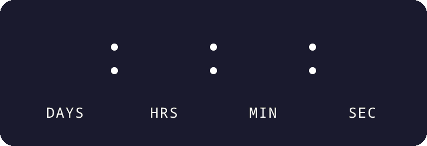
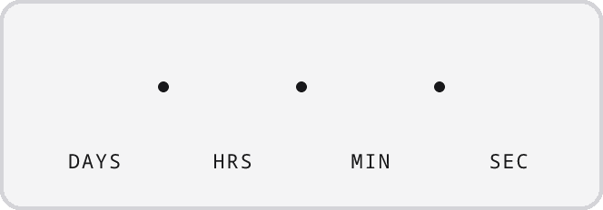

# email-countdown-timer

**Self-hosted animated countdown timers for email.** Renders an animated GIF (plus a static PNG for
Outlook) that you drop into any email with a plain `` tag. Works in Mailchimp, Klaviyo, HubSpot,
Brevo, SendGrid — anywhere you can write HTML.

No database. No account. No Chrome. No external calls. One container.

<p align="center">
  
</p>

<p align="center">
  
  
  
</p>

## Why this exists

Every countdown timer for email is a paid subscription — Sendtric, NiftyImages, MotionMail,
CountdownMail. They all do the same thing: render a GIF on a server and hand you an image URL. That is
a weekend of work and a permanent line item on your invoice.

|                        | This            | Hosted services       |
| ---------------------- | --------------- | --------------------- |
| Price                  | Free            | $5–$50+/month         |
| Where your data lives  | Your server     | Theirs                |
| Timer limit            | None            | Metered by plan       |
| Views / impressions    | Unlimited       | Often capped          |
| Works offline / on-prem| Yes             | No                    |
| Custom fonts + colours | Yes             | Usually paid tiers    |
| Runs without an account| Yes             | No                    |

## Quick start

```bash
docker run -p 8080:8080 ghcr.io/temway/email-countdown-timer
```

Open <http://localhost:8080> for a builder that previews the timer and gives you the HTML to paste. It
has a light/dark toggle — worth flipping if your board is transparent, since that is the quickest way
to see the timer against both a light and a dark email background.

Or without Docker:

```bash
npx email-countdown-timer
```

Then use it in an email:

```html
<a href="https://example.com/sale">
  
</a>
```

> **`width` is required.** Images render at 2× by default so they stay sharp on a Retina display, so
> the file above is 724px wide and must be *declared* at 362 — its width in CSS pixels. Leave `width`
> off and it draws at double size. The builder always emits the right number; see
> [Retina rendering](#retina-rendering).

## URL API

`GET /c.gif` — animated GIF · `GET /c.png` — static first frame, for Outlook

| Parameter     | Default                      | Notes                                                        |
| ------------- | ---------------------------- | ------------------------------------------------------------ |
| `until`       | **required**                 | ISO 8601 with an explicit offset, e.g. `2026-12-25T00:00:00Z` |
| `units`       | `days,hours,minutes,seconds` | Any comma-separated subset; order is normalised               |
| `labels`      | `1`                          | `0` hides the DAYS/HRS/MIN/SEC captions                       |
| `labelDays`   | `DAYS`                       | Custom caption, max 12 characters — see below                 |
| `labelHours`  | `HRS`                        | Custom caption                                                |
| `labelMinutes`| `MIN`                        | Custom caption                                                |
| `labelSeconds`| `SEC`                        | Custom caption                                                |
| `digit`       | `ffffff`                     | 6-digit hex, with or without `#`                              |
| `board`       | `1a1a2e`                     | 6-digit hex, or `transparent`                                 |
| `border`      | `1a1a2e`                     | 6-digit hex                                                   |
| `borderWidth` | `0`                          | `0`–`24` px                                                   |
| `divider`     | `colon`                      | `colon` · `dot` · `space`                                     |
| `shape`       | `rounded`                    | `rounded` · `rectangle`                                       |
| `size`        | `48`                         | Digit size in CSS px, `12`–`160`                              |
| `scale`       | `2`                          | Device pixels per CSS px — `1` or `2`. See below              |

Invalid values return `400` with a message naming the field, rather than quietly rendering something
you did not ask for. Unknown parameters (`utm_source`, `fbclid`) are ignored, because CDNs and email
clients append them.

### Retina rendering

Most email is read on a 2×-density screen, so the default is `scale=2`: the board is rasterised at
double resolution and the digits stay sharp instead of being upscaled by the client.

Every other dimension — including `size` — is in **CSS pixels**, and the layout does not change with
`scale`. Only the file gets bigger. So the rule for the `` tag is:

```
width = pixel width of the file ÷ scale
```

At the default that is half the file's width. Get it wrong and the timer draws twice as large as
intended in every client; the builder at `/` reads the width off the rendered image and does the
division for you.

**A rendered image may be at most 1200px wide.** An email body is about 600px, which is 1200 device px
at 2×, past which a larger render buys a recipient nothing. This — not the `size` bound — is the
constraint you will actually hit, because the board's width also depends on how many units you show
and how long your captions are. Exceeding it returns `400` naming the width, e.g.:

```
size: the board renders 2416px wide at scale=2, over the 1200px maximum
      — reduce size, drop a unit, shorten a caption, or use scale=1
```

`scale=1` restores the pre-2× behaviour byte for byte, and is the escape hatch if you genuinely want a
board wider than an email.

### Custom captions

Rename any unit, and leave the rest alone:

```
/c.gif?until=2026-12-25T00:00:00Z&labelDays=JOURS&labelHours=HEURES
```

A caption wider than its two digit slots widens the **board** rather than clipping, so long words are
safe — but they are not free, which is why 12 characters is the cap. A blank value means "use the
default", not "draw nothing"; hide all captions with `labels=0`.

The bundled font is Noto Sans Mono, which covers Latin, Greek, Cyrillic and Vietnamese. `ДНИ` and
`NGÀY` render; Chinese, Japanese, Hebrew and Arabic render as empty boxes. For those, register a font
that covers your script **before you serve any request** — the raster cache is keyed on the design,
not on the font:

```ts
import { setFont } from 'email-countdown-timer';

setFont('/fonts/NotoSansSC-Regular.ttf', 'Noto Sans SC');
```

### Always pair the GIF with the PNG

Outlook on Windows renders only the first frame of a GIF. That first frame is the *blank board*, so
pointing Outlook at `.gif` shows a timer with no digits. `/c.png` is a separate composite of the board
plus the current digits — use it in an Outlook conditional if you support Outlook.

## Configuration

Everything is optional; the server runs correctly with no environment set at all.

| Variable         | Default   | Purpose                                                     |
| ---------------- | --------- | ----------------------------------------------------------- |
| `PORT`           | `8080`    |                                                             |
| `HOST`           | `0.0.0.0` |                                                             |
| `SIGNING_SECRET` | unset     | When set, every request needs a matching `sig` HMAC          |
| `PUBLIC_ORIGIN`  | unset     | Public origin, e.g. `https://countdown.example.com`          |

Turn on `SIGNING_SECRET` for any instance exposed to the internet. Without it, your renderer is an
open compute endpoint that anyone can point at arbitrary parameters. Generate URLs with the exported
`sign()` helper.

`PUBLIC_ORIGIN` only matters if you want your instance indexed. Setting it adds canonical, Open
Graph and Twitter tags to the builder page, serves `/sitemap.xml`, and redirects the builder to
that host so the snippets it generates cannot point at a hostname you intend to move off. Leave it
unset and none of that appears, and `/robots.txt` disallows everything — a private instance should
not turn up in search results because it inherited a default.

Either way `/robots.txt` keeps crawlers off `/c.gif` and `/c.png`. Every query string is a distinct
URL there, so a crawler walking them renders an image per URL indefinitely.

## Use as a library

```ts
import { renderCountdown, DEFAULT_DESIGN } from 'email-countdown-timer';

const { gif, png } = renderCountdown(
  {
    ...DEFAULT_DESIGN,
    digitColor: '#ffd166',
    boardBackground: '#0b2a4a',
    unitLabels: { days: 'TAGE', hours: 'STD', seconds: 'SEK' }, // minutes keeps MIN
  },
  Date.parse('2026-12-25T00:00:00Z'),
  Date.now(),
);
```

The compositor is also exposed on its own. It takes decoded RGBA rasters and bounding boxes and knows
nothing about where they came from, so you can render the board and digits in a design tool, a
headless browser, or anything else, and still use the GIF encoder:

```ts
import { renderCountdownGif, generateArtifacts } from 'email-countdown-timer';
```

## Known limitations

These are real and worth knowing before you ship. Most apply to every email countdown timer, paid ones
included.

- **Email clients cache images.** Gmail proxies remote images and may serve a cached frame instead of
  re-fetching. Short `max-age` helps but does not fully defeat it. Treat a countdown as a strong
  visual cue, not a to-the-second clock.
- **99 days is the ceiling.** Each unit has two digit slots. Anything longer is pinned at
  `99:23:59:59` rather than wrapping — an earlier version rendered 130 days as "30", which is a wrong
  number rather than a rounded one.
- **Units show a natural decomposition, not a total.** Hiding `days` does not roll those days into
  `hours`; hours stay in the 0–23 range. A two-day timer showing only `hours,minutes,seconds` reads
  `05:30:00`, not `53:30:00`.
- **Animation runs for 30 frames**, one per second, then holds. That is a deliberate size trade-off —
  a full-hour animation would be megabytes.
- **The bundled font is Latin/Greek/Cyrillic/Vietnamese only.** A caption in a script it does not
  cover renders as empty boxes rather than failing, because nothing in the pipeline can tell a
  missing glyph from a deliberate one. Register your own font — see
  [Custom captions](#custom-captions).

## How it works

The interesting part is the GIF encoder. A naive implementation composites frames in RGBA and
re-quantises each one, which produces visible colour drift, worse dithering and roughly 30% larger
files. Instead this does a **per-frame background-aware palette composite**: for every source pixel it
looks up the background frame's palette index, alpha-blends in RGBA space, finds the nearest palette
entry, and caches the result keyed by `(source, background)`.

Frame 0 is the blank board with `dispose: 1` (DO NOT DISPOSE), so it stays as the persistent base.
Every following frame carries only that second's digits with `dispose: 3` (RESTORE PREVIOUS), which
wipes them back to the blank board before the next frame draws — so a narrow digit can never leave
ghost pixels behind a wider one it failed to cover.

Rasters are produced in-process with [resvg](https://github.com/yisibl/resvg-js), with system fonts
disabled and exactly one font registered. That is what makes rendering deterministic: the same URL
produces identical bytes on your laptop, in CI, and in the container.

## Development

```bash
pnpm install
pnpm dev            # tsx watch, http://localhost:8080
pnpm test           # vitest
pnpm typecheck
pnpm build
pnpm demos          # regenerate the README demo GIFs in assets/
pnpm demos --check  # verify they are current, write nothing
```

The compositor ships with golden-image fixtures — real captured board and digit rasters plus the
expected GIF and PNG output. Those tests are the contract; if you touch `src/render/`, they must stay
green.

The demo GIFs above are generated, not hand-made: their designs live in
[`src/tools/generate-demos.ts`](src/tools/generate-demos.ts) and render through the same
`renderCountdown` path `/c.gif` uses, pinned to a fixed remaining time so the output is reproducible.
The script also prints the `` tags with the correct CSS `width` for each. Run `pnpm demos` after
any change that alters rendered output, or `pnpm demos --check` to find out whether you need to.

## Licence

MIT. See [LICENSE](LICENSE).

Bundles **Noto Sans Mono** under the SIL Open Font License 1.1 (see [`fonts/OFL.txt`](fonts/OFL.txt)).
Uses [resvg-js](https://github.com/yisibl/resvg-js), which is MPL-2.0 — file-level copyleft that does
not affect your own code.

---

Built by the team behind [Temway](https://temway.com), an on-brand email builder for teams and their
AI agents. If you want a visual editor around timers like this one, that is what we make.
